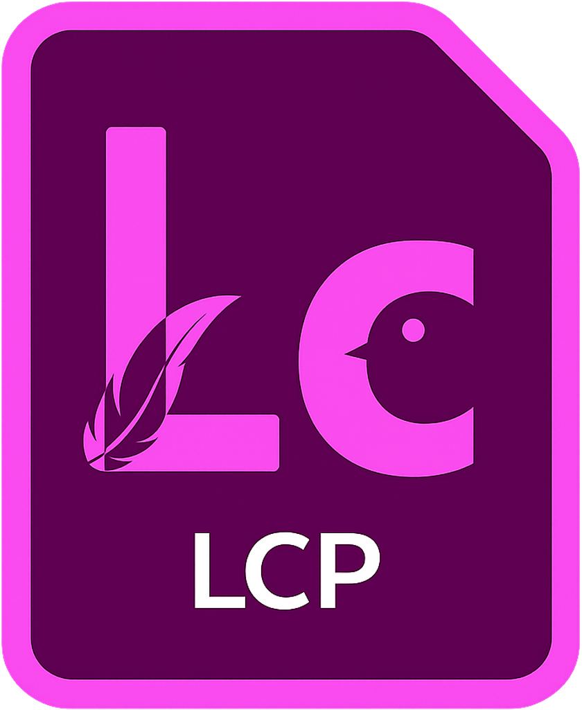

  

<h1 align="center">LineCut</h1>

从字幕出发，快速找到、整理并导出视频片段。

  
  
  

  <a href="https://github.com/Inexplicable-YL/be/releases/latest">下载最新版</a>
  ·
  <a href="#快速开始">快速开始</a>
  ·
  <a href="#常见问题">常见问题</a>

---

## 这是什么？

LineCut 是一款 Windows 桌面工具，帮助你从字幕或台词出发，在长视频中迅速找到需要的段落，并导出为可直接使用的片段。无需手动拖动时间轴反复试听：搜索一句台词、勾选结果、设置前后留白，即可批量输出。

它尤其适合课程、访谈、直播回放、影视素材、播客视频和其他“先知道内容、再寻找画面”的整理场景。

## 你可以用 LineCut 做什么？

- 搜索字幕中的关键词，快速定位人物台词、知识点或高光片段。
- 将多条字幕批量导出为独立短片，或按时间顺序合并为一个视频。
- 为片段加入可自定义的片头、片尾留白和合并间隔。
- 导入外部字幕，或直接使用视频内嵌的字幕流。
- 在一个项目中整理多个视频、音频与字幕，并将音频、字幕绑定到对应视频。
- 为性能较弱的设备生成代理文件，获得更流畅的预览体验。
- 保存 `.lcp` 项目、记录编辑历史，并在素材移动后重新链接媒体。

## 快速开始

1. 从 [Releases](https://github.com/Inexplicable-YL/be/releases/latest) 下载并安装最新版。
2. 首次安装时选择“内置 FFmpeg（推荐）”；如电脑已有 FFmpeg，也可指定现有路径。
3. 启动 LineCut，新建项目后导入视频、音频或字幕文件。
4. 在“字幕”面板搜索台词、勾选需要的条目，并在源预览中确认内容。
5. 打开“导出设置”，选择导出目录、命名方式和导出模式，开始导出。

## 核心功能

### 用字幕定位视频内容

- 支持关键词搜索、字幕轨切换、全选与仅查看已选字幕。
- 字幕列表会跟随播放进度定位当前条目，并显示对应画面缩略图。
- 点击字幕或缩略图即可跳转并播放对应位置。
- 支持视频内嵌字幕，以及 `SRT`、`ASS`、`SSA`、`VTT` 等外挂字幕。

### 灵活导出片段

- **极速拷贝**：直接复制媒体流，速度快且不会重新压缩画面；适合对切点精度要求不高的场景。
- **精确重编码**：重新编码输出，适合需要更准确切点与更广泛兼容性的场景。
- 可选择逐条输出，或将多个片段按时间顺序合并。
- 支持按源文件名、时间范围或台词内容自动命名。
- 可为片段设置前后留白，并控制合并片段之间的间隔。

### 媒体箱与项目管理

- 使用多级媒体箱整理视频、音频与字幕，支持列表和图标两种视图。
- 支持搜索、排序、重命名、复制、粘贴、移动、隐藏、禁用和删除媒体。
- 可分解视频中的音轨和字幕流，也可将外部音频、字幕绑定到目标视频。
- 素材移动、替换或丢失后，可通过重新链接恢复项目。
- 支持连接、分离和生成代理媒体；原始媒体脱机时仍可继续使用已连接的代理预览。

### 为持续编辑而设计

- `.lcp` 项目文件保存媒体组织、字幕选择、导出设置与工作状态。
- 自动保存项目快照；检测间隔和保留数量可在“首选项”中调整。
- 历史记录面板会列出项目操作，支持撤销、重做和跳转到指定历史状态。
- 面板可停靠、拆分和调整位置；你的工作区布局会在下次启动时自动恢复。
- Windows 资源管理器可为 `.lcp` 项目显示 LineCut 缩略图，便于辨认项目文件。

## 支持的媒体

常见视频容器包括 `MP4`、`MKV`、`MOV`、`WebM`、`AVI`、`TS`、`M2TS` 等。实际可用性还取决于视频所使用的编解码器及当前 FFmpeg 配置。

对于大型、高分辨率或高码率素材，建议先创建代理文件，再进行浏览、检索和剪辑确认。

## 项目文件与素材

LineCut 项目以 `.lcp` 文件保存。项目记录的是素材路径、字幕、编辑选择和相关设置，不会将原始视频复制进项目文件。

如果要将项目交给另一台电脑继续编辑，请同时提供原始媒体文件；打开项目后如提示素材脱机，可在媒体箱中使用“重新链接”恢复路径。LineCut 0.2.0 保存的项目采用受保护的项目格式，建议始终保留原始项目备份。

## 系统要求

- Windows 10 或 Windows 11（64 位）
- 最低窗口可用尺寸：1080 × 700
- 建议使用 1920 × 1080 或更高分辨率的显示器
- 足够的磁盘空间用于缓存、代理文件和导出视频

安装程序默认可安装内置 FFmpeg。若选择使用系统已有的 FFmpeg，可稍后在“编辑 → 首选项”中调整 `FFmpeg` 与 `ffprobe` 路径。

## 数据与隐私

LineCut 的媒体分析、预览、字幕处理和导出均在本机完成。你的源视频不会因为使用 LineCut 而自动上传到云端。

请注意：项目文件不是媒体备份。请妥善保管原始素材、导出文件和重要项目的副本。

## 常见问题

### 导出或导入失败怎么办？

先确认 FFmpeg 可用。若安装时未选择内置 FFmpeg，或系统中的 FFmpeg 路径发生变化，请前往“编辑 → 首选项”重新指定 `FFmpeg` 和 `ffprobe`。

### 素材移动后项目打不开或无法预览？

在媒体箱中选中脱机素材，使用右键菜单中的“重新链接”或“重新连接完整分辨率媒体”，选择移动后的文件即可。多个同名文件位于同一目录时，可使用自动重新链接加快恢复。

### 为什么极速拷贝的切点不够精确？

极速拷贝依赖源视频关键帧，因此速度更快但切点可能存在偏差。需要更精确的开始与结束位置时，请在导出设置中选择“精确重编码”。

### 升级到 0.2.0 后还能用旧版本打开项目吗？

可以用 0.2.0 打开 0.1.x 项目；但旧项目在 0.2.0 保存后会升级为新的项目格式，不能再由 0.1.1 打开。升级前请备份重要 `.lcp` 文件。

## 反馈与许可

欢迎通过 [GitHub Issues](https://github.com/Inexplicable-YL/be/issues) 提交问题、建议或使用反馈。

LineCut 应用代码采用 [Apache License 2.0](LICENSE) 发布。安装包中可选内置的 FFmpeg / FFprobe 及其许可信息请见 [第三方声明](THIRD_PARTY_NOTICES.md)。

  Made with ❤️ by GCL MAD CLUB · <a href="https://github.com/Inexplicable-YL">言ktdm</a>

